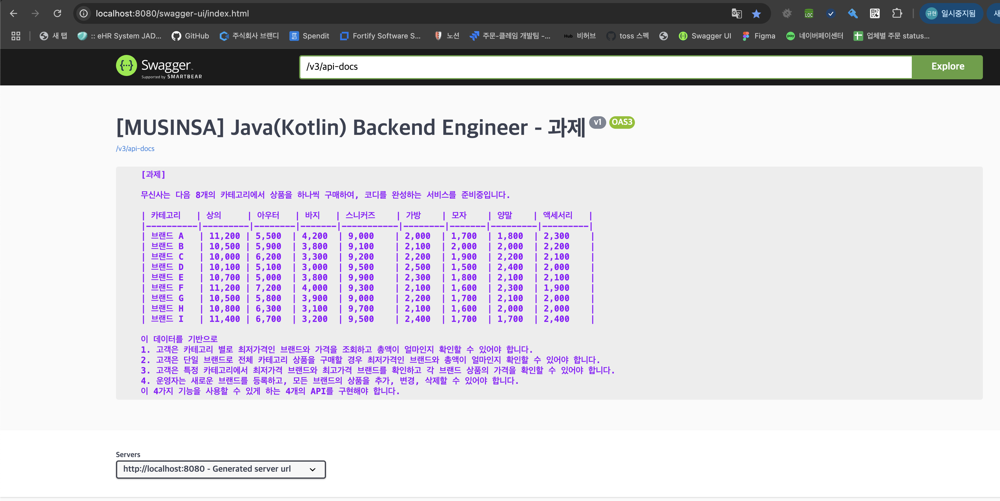

# Back-end 과제
이 프로젝트는 Spring Boot(3.3.5) 와 H2 Database를 사용하여 
무신사 과제에서 요구하는 기능을 Application 입니다. 

## 구현 기능
- **구현 1)** [카테고리 별 최저가격 브랜드와 상품 가격, 총액을 조회하는 API](http://localhost:8080/swagger-ui/index.html#/%EC%83%81%ED%92%88%20-%20%EC%B9%B4%ED%85%8C%EA%B3%A0%EB%A6%AC/category)
  - API
    ```text
      api endpoint : /v1/products/categories/lowest-price/brands (GET)
      api endpoint 설명 : 
       - /v1: API 버전
       - /products: 상품 도메인.
       - /categories: 카테고리 기능
       - /lowest-price: 가장 저렴한 가격.
       - /brands: 브랜드를 기준으로 필터링된 결과를 제공할수 있도록 확장. 
    ```
  
  - 카테고리 별 최저가 브랜드 조회 (SQL)
    ```sql
      #native sql 활용 
      SELECT 
        TB_PRODUCT_BRAND_CATEGORY_RANKED.CATEGORY, 
        TB_PRODUCT_BRAND_CATEGORY_RANKED.BRAND, 
        TB_PRODUCT_BRAND_CATEGORY_RANKED.PRICE
      FROM (
          SELECT
          PBC.CATEGORY,
          PBC.BRAND,
          PBC.PRICE,
          ROW_NUMBER() OVER (PARTITION BY PBC.CATEGORY ORDER BY PBC.PRICE ASC, PBC.BRAND ASC) AS ROW_NUM
          FROM
          TB_PRODUCT_BRAND_CATEGORY PBC
      ) AS TB_PRODUCT_BRAND_CATEGORY_RANKED
      WHERE TB_PRODUCT_BRAND_CATEGORY_RANKED.ROW_NUM = 1
    ```
  - 카테고리 별 최저가 브랜드 조회 설명
    - TB_PRODUCT_BRAND_CATEGORY 테이블에서 카테고리, 브랜드, 가격 항목을 선택.
    - ROW_NUMBER(): 윈도우 함수를 사용해 각 카테고리 내에서 가격을 기준으로 오름차순 정렬하여 번호 채번.
      (가격 기준으로 오름차순 정렬하여 가장 낮은 가격이 1번 부여됨.
      가격이 동일한 경우, BRAND 오름차순으로 정렬하여 순위를 매깁니다.
      이 결과, 각 카테고리별로 ROW_NUM = 1인 행이 최저 가격의 브랜드.
    - code level 에서 상수로 정의 된 카테고리 노출 순서로 steram().sorted 카테고리 정렬. 
    - 조회된 상품 가격의 총합을 sum.(code level) 총액 제공.
    - Dto 구성시 가격 정보 String cast 및 콤마 (,) 삽입 후 응답 제공

  - 요청 및 응답
    - 정상 응답 : `HTTP/1.1 200 OK` 
    - 정상 응답의 경우 data 항목으로 제공 됨.
    ```text
    # 요청 Curl
    curl -X 'GET' \
    'http://localhost:8080/v1/products/categories/lowest-price/brands' -H 'accept: application/json'

    #응답 body payload (Json)
    {
       "data": {
           "products": [
                {
                    "brand": "C",
                    "category": "상의",
                    "price": "10,000"
                },
                {
                     "brand": "E",
                     "category": "아우터",
                     "price": "5,000"
                },
                {
                     "brand": "D",
                     "category": "바지",
                     "price": "3,000"
                },
                {
                     "brand": "A",
                     "category": "스니커즈",
                     "price": "9,000"
                },
                {
                     "brand": "A",
                     "category": "가방",
                     "price": "2,000"
                },
                {
                     "brand": "D",
                     "category": "모자",
                     "price": "1,500"
                },
                {
                     "brand": "I",
                     "category": "양말",
                     "price": "1,700"
                },
                {
                     "brand": "F",
                     "category": "액세서리",
                     "price": "1,900"
                }
           ],
           "totalPrice": "34,100"
       }
    }
            
  
- **구현 2)** [단일 브랜드로 모든 카테고리 상품을 구매할 때 최저가격에 판매하는 브랜드와 카테고리의 상품가격, 총액을 조회하는 API](http://localhost:8080/swagger-ui/index.html#/%EC%83%81%ED%92%88%20-%20%EB%B8%8C%EB%9E%9C%EB%93%9C/brands)
   - API
     ```text
     api endpoint : /v1/products/brands/lowest-price (GET)
     api endpoint 설명 : 
      - /v1: API 버전
      - /products: 상품 도메인.
      - /brands: 브랜드 기능
      - /lowest-price 최저가 
     ```
   - 브랜드 별 카테고리 총액 최저가 조회 설명
     - queryDsl 사용.
     - `group by 브랜드 order by SUM(가격) 오름 차순 정렬 후 최저가 limit 1 브랜드로` 서브 쿼리 조회
   - 요청 및 응답
     - 정상 응답 : `HTTP/1.1 200 OK` 
     - 정상 응답의 경우 data 항목으로 제공 됨.
     - 과제 응답값 준수 하기 위해 Dto 의 각 필드 명을 `@JsonProperty` 를 이용하여 한글 매핑함.
     ```java
     // Json 필드 한글 매핑.
     public class LowestPriceBrandCategoryDto {
         @Schema(title = "브랜드", example = "A")
         @JsonProperty("브랜드")
         private String brand;
         @Schema(title = "카테고리", example = "상의")
         @JsonProperty("카테고리")
         private List<LowestPriceCategoryDto> categories;
         @Schema(title = "총액", example = "1,000")
         @JsonProperty("총액")
         private String totalPrice;
     }
     ```
     ```text
     # 요청 Curl
     curl -X 'GET' \
     'http://localhost:8080/v1/products/brands/lowest-price' -H 'accept: application/json'

     #응답 body payload (Json)
     {
         "data": {
             "최저가": {
             "브랜드": "D",
             "카테고리": [
             {
                 "카테고리": "상의",
                 "가격": "10,100"
             },
             {
                 "카테고리": "아우터",
                 "가격": "5,100"
             },
             {
                 "카테고리": "바지",
                 "가격": "3,000"
             },
             {
                 "카테고리": "스니커즈",
                 "가격": "9,500"
             },
             {
                 "카테고리": "가방",
                 "가격": "2,500"
             },
             {
                 "카테고리": "모자",
                 "가격": "1,500"
             },
             {
                 "카테고리": "양말",
                 "가격": "2,400"
             },
             {
                 "카테고리": "액세서리",
                 "가격": "2,000"
             }
         ],
         "총액": "36,100"
         }
      }
     }
     ```

- **구현 3)** [카테고리 이름으로 최저, 최고 가격 브랜드와 상품 가격을 조회하는 API](http://localhost:8080/swagger-ui/index.html#/%EC%83%81%ED%92%88%20-%20%EC%B9%B4%ED%85%8C%EA%B3%A0%EB%A6%AC/getCategory)
  - API
    ```text
    api endpoint : /v1/products/categories/{category}/price-range/brands (GET)
    api endpoint 설명 :
    - /v1: API 버전
    - /products: 상품 도메인.
    - /categories: 카테고리 기능
    - /{category}: 카테고리 이름 (PathVariable)
    - /price-range: 최저, 최고가
    - /brands: 브랜드를 기준으로 필터링된 결과를 제공할수 있도록 확장.
    ```

  - 카테고리 이름으로 최저, 최고 가격 브랜드와 상품 가격을 조회 설명
    - 카테고리 명 유효성 검사
    - queryDsl 사용.
      - 요청된 `카테고리 조건으로 MIN(PRICE)-최저가, MAX(PRICE)-최고가 가격 조회` 후 브랜드 정보 추출.
  - 요청 및 응답
    - 정상 응답 : `HTTP/1.1 200 OK` 
    - 정상 응답의 경우 data 항목으로 제공 됨.
    - 과제 응답값 준수 하기 위해 Dto 의 각 필드 명을 `@JsonProperty` 를 이용하여 한글 매핑함.
    ```text
    # 요청 Curl
    curl -X 'GET' \
    'http://localhost:8080/v1/products/categories/%EC%83%81%EC%9D%98/price-range/brands' -H 'accept: application/json'
    
    #응답 body payload (Json)
    {
        "data": {
            "카테고리": "상의",
            "최저가": [
                {
                    "브랜드": "C",
                    "가격": "10,000"
                }
            ],
            "최고가": [
                {
                     "브랜드": "I",
                     "가격": "11,400"
                }
            ]
        }
    }
    ```      
- **구현 4)** 
  - [브랜드 및 상품 추가 API](http://localhost:8080/swagger-ui/index.html#/%EC%83%81%ED%92%88%20-%20%EB%B8%8C%EB%9E%9C%EB%93%9C/createCategory)
  - [브랜드 및 상품 수정 API](http://localhost:8080/swagger-ui/index.html#/%EC%83%81%ED%92%88%20-%20%EB%B8%8C%EB%9E%9C%EB%93%9C/updateCategory)
  - [브랜드 및 상품 삭제 API](http://localhost:8080/swagger-ui/index.html#/%EC%83%81%ED%92%88%20-%20%EB%B8%8C%EB%9E%9C%EB%93%9C/deleteCategory)
    - API 
      ```text
      api endpoint : /v1/products/brands
      api endpoint 설명 :
      - /v1: API 버전
      - /products: 상품 도메인.
      - /brands: 브랜드 기능
      method  :
      - (POST) : 브랜드 및 상품 추가.
      - (PUT) : 브랜드 및 상품 수정
      - (DELETE) : 브랜드 및 상품 삭제 
      ```
    - 브랜드 및 상품 추가/수정/삭제 설명
      - end point 공통 사용 method 구분.
      - @RequestBody 공통 Dto 사용. (Json)
      - `@Valid` Dto validated 사용  
      - 브랜드 상품 존재 여부 유효성 검증
      - queryDsl 사용.

  - 요청 및 응답
      - 정상 응답의 경우 data 항목으로 제공 됨.
      - 브랜드 및 상품 추가 응답 코드 : `HTTP/1.1 201 Created`
      - 브랜드 및 상품 삭제 응답 코드 : `HTTP/1.1 204 No Content`, Body Payload 미 제공
      - 그 외 정상 응답 : `HTTP/1.1 200 OK`
      ```text 
      # 요청 Curl
      curl -X '{POST}|{PUT}|{DELETE}' \
      'http://localhost:8080/v1/products/brands' \
      -H 'accept: application/json' \
      -H 'Content-Type: application/json' \
      -d '{
       "brand": "A",
       "category": "점퍼",
       "price": 1000
      }'
    
      #응답 body payload (Json)
      {
          "brand": "A",
          "category": "점퍼",
          "price": 1000
      }
    
---  
## Project 스펙
- Java : [Corretto 17](https://aws.amazon.com/ko/about-aws/whats-new/2021/09/amazon-corretto-17-now-available/)
- Spring Boot : **[3.3.5](https://spring.io/projects/spring-boot#support)**
- Spring Framework: 6.1.14
  - Apache Tomcat/10.1.31
- Gradle : 8.10.2
- **H2 Database** (임베디드 메모리)
---
## 실행 방법
### 0. JDK 설치
JDK : [Amazon Corretto 17 다운로드](https://docs.aws.amazon.com/corretto/latest/corretto-17-ug/downloads-list.html)

### 1. 프로젝트 클론
Git을 통해 프로젝트를 로컬에 클론
```bash
git clone https://github.com/kimkh144/musinsa.git 
```
### 2. 프로젝트 이동
```bash
cd musinsa
```
### 3. 프로젝트 의존성 설치, 애플리케이션 실행
```bash
./gradlew bootRun
```
### 4. Application 정상 동작 확인
- 기본 포트는 8080이며, 브라우저에서 아래 URL을 입력
  - swagger-ui : http://localhost:8080/swagger-ui/index.html
  - h2-console : http://localhost:8080/h2-console
    - h2-console 접속 정보 (임베디드 메모리 방식)
      - JDBC URL: jdbc:h2:mem:/musinsa
      - User Name: sa
      - Password: musinsa
    - 테이블 스키마 application 시작 시 create 및 종료 시 drop **(ddl-auto: create-drop)**
      ```text
      jpa:
          database-platform: org.hibernate.dialect.H2Dialect
          generate-ddl: true
          hibernate:
              ddl-auto: create-drop
          defer-datasource-initialization: true
      ```
---
## 프로젝트 패키지 구조
- 도메인 구조로 설계
```text
├── java
│   └── com
│       └── musinsa
│           └── backend
│               ├── MusinsaApplication.java   
│               ├── domain
│               │   └── product                          # 상품 도메인 (product)
│               │       ├── controller
│               │       │   ├── BrandController.java     # 브랜드 기능 제공 
│               │       │   └── CategoryController.java  # 카테고리 기능 제공
│               │       ├── dto                          # product 도메인의 dto 객체 (응답)
│               │       │   └── request                  # product 도메인의 dto 객체 (요청)
│               │       ├── entity
│               │       │   ├── BrandCategoryEntity.java # JPA 엔티티 
│               │       │   └── BrandCategoryId.java     # 복합 키 관리
│               │       ├── repository                   # repository 관리
│               │       │   └── Impl                     # 커스텀 repository 구현체 관리
│               │       └── service                      # 서비스 layer (비즈니스 기능)
│               └── global                               # 전역 설정 기능     
│                   ├── enums                            # 공통 enum class 관리 (ex : error-code)
│                   ├── common                           
│                   │   ├── exception                    # 커스텀 exception 처리 관리
│                   │   │   └── ServiceException.java
│                   │   └── response                     # common response model 관리 
│                   ├── config                           # spring 설정 클래스
│                   ├── constants                        # 상수 관리
│                   └── utils                            # 유틸 관리
└── resources
    ├── application.yml                                  # spring boot 설정 파일 
    ├── data.sql                                         # H2 Database DML (기초 데이터)
    ├── schema.sql                                       # H2 Database DDL (스키마)


```
---
## Database
데이터베이스는 **H2 Database**를 사용하여 Spring Boot 애플리케이션과 연동되며, 주요 테이블 및 필드는 다음과 같습니다.
### 1. `TB_PRODUCT_BRAND_CATEGORY` 테이블

상품의 브랜드, 카테고리, 가격 관리를 위한 테이블 입니다.
제동된 데이터를 기반으로 상품 브랜드와 상품 카테고리를 복합키로 설정하여 상품 가격정보를 관리 한다. 

| 필드 이름        | 데이터 타입      | 설명       | 기본키 |
|--------------|-------------|----------|-----|
| `BRAND`      | VARCHAR (8) | 상품 브랜드 명 | PK  |
| `CATEGORY`   | VARCHAR(128) | 상품 카테고리 명 | PK  |
| `PRICE`      | BIGINT      | 상품 가격    |     |

- **기본 키(Primary Key)**: BRAND, CATEGORY 복합 키 구성
- **인덱스**: 미 적용 (인메모리 방식을 사용.)

### 2. 데이터베이스 초기화 및 스키마 설정

`src/main/resources` 디렉토리 내의 
1. 스키마 생성 : `schema.sql` 
2. 기초 데이터 등록: `data.sql`
---
## 컨벤션
### 1. Packages
- **Standard**: 모든 패키지 이름은 소문자로 구성하고, 단어는 마침표(`.`)로 구분.
- **Structure**: 기본적으로 `com.[company].` 구조를 사용, 하위 패키지는 기능별로 구분.

### 2. Classes and Interfaces
- **Class Names**: CamelCase 사용, 첫문자 대문자
- **Interface Names**: 일반적으로 클래스처럼 CamelCase 사용, `I` 접두사를 사용하지 않음.

### 3. Methods
- **Method Names**: camelCase 사용, 동사형.
- **Handler Methods in Controllers**: 메서드명은 HTTP 메서드와 관련된 의미를 포함.
  - 예시: `getUser()`, `createUser()`, `updateOrder()`, `deleteProduct()`

### 4. Variables
- **Local Variables and Parameters**: camelCase 사용, 변수의 역할을 나타내는 의미 있는 이름을 사용.
- **Constants**: 전체 대문자 사용, 단어 사이에 밑줄(`_`)을 사용.
  - 예시: `MAX_RETRIES`, `DEFAULT_TIMEOUT`

### 5. Database Naming Conventions (H2 Database)
- **Table Names**: 대문자 사용. `TB_` 접두사를 사용, 여러 단어는 밑줄(`_`)로 구분.
  - 예시: `TB_PRODUCT_BRAND_CATEGORY`
- **Column Names**: 대문자 사용, 여러 단어는 밑줄(`_`)로 구분.
  - 예시: `USER_ID`, `ORDER`, `CATEGORY`
---
### REST API Common Response Payload 구성
```text
{
    "meta": {     # 메타 항목. 페이지네이션 정보 제공
        "totalCount": 100,      # 전체 아이템 수
        "currentCount": 10,     # 현재 아이템 수
        "currentPage": 1,       # 현재 페이지
        "totalPage": 10,        # 전체 페이지
    },   
    "data": {     # 데이터 항목. API 응답 제공
        "카테고리": "스니커즈",
        "최저가": [
             {
                 "브랜드": "A",
                 "가격": "9,000"
             },
             {
                 "브랜드": "G",
                 "가격": "9,000"
             }
         ],
         "최고가": [
             {
                  "브랜드": "E",
                  "가격": "9,900"
             },
             {
                  "브랜드": "H",
                  "가격": "9,900"
             }
          ]
    },   
    "error": {    # 에러 항목. API 응답 에러 발생 시 error 정보 제공
        "code": 400,                                                 # http 응답 코드
        "errorCode": "string",                                       # error code (커스텀)
        "message": "유효한 요청이 아닙니다.",                              # error 메시지 (커스텀) 
        "validation": "[{category=카테고리 정보는 필수 입력 되어야 합니다.}]"   # validation 오류 발생 사유 (@Valid 오류 메시지)
    }
}
```
---  
## Unit Test
- Swagger : [swagger 바로가기](http://localhost:8080/swagger-ui/index.html)

- JUnit
```bash
  ./gradlew test
```